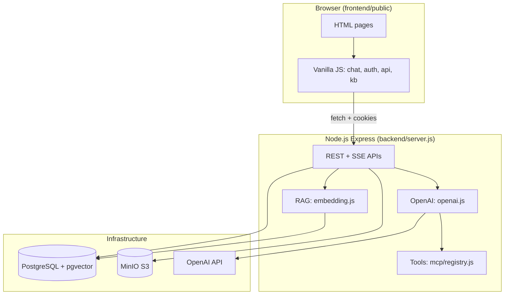
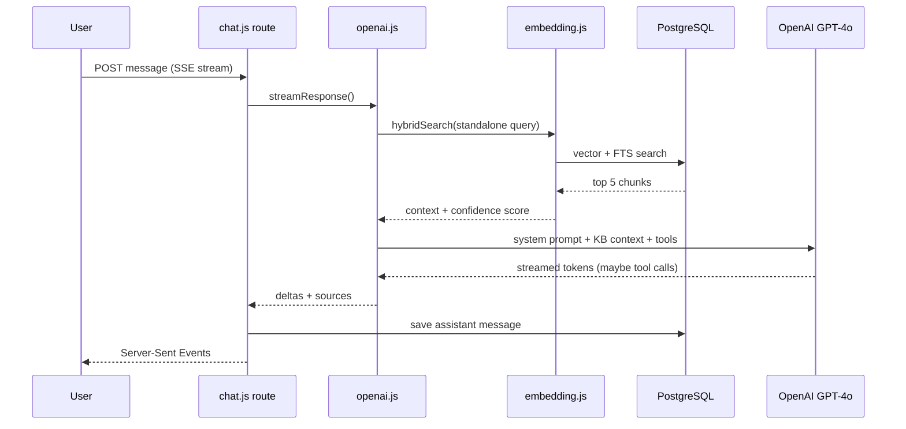

# AskMak — Full Project Explanation (College Panel)

**AskMak** is an **ICT Helpdesk support chatbot** for **Makerere University**. Students ask questions about portals, Wi‑Fi, email, passwords, MUELE, and similar technical topics. Answers are **grounded in an approved knowledge base** (not free-form ChatGPT answers), with guardrails so the bot refuses out-of-scope questions (fees policy, admissions essays, etc.).

---

## 1. Problem & Solution (What to Say in 30 Seconds)

| Problem | Solution |
|--------|----------|
| Students repeat the same ICT questions | Curated KB + RAG (retrieval-augmented generation) |
| Generic AI gives wrong or invented answers | Strict system prompt + confidence thresholds |
| Need human follow-up when KB fails | Support tickets + admin escalation |
| Privacy for casual users | Guest chat (no DB history) vs signed-in users (saved chats) |

---

## 2. High-Level Architecture



**One process serves everything:** Express hosts the API **and** static frontend files from `frontend/public/`.

---

## 3. Repository Structure

```
askmakchatbot/
├── package.json          # Root scripts: start, dev, ingest, setup
├── .env                  # Secrets (OpenAI, JWT, DB, MinIO, SMTP)
├── docker-compose.yml    # Postgres (pgvector) + MinIO
├── Dockerfile            # Production container image
│
├── backend/
│   ├── server.js         # App entry: middleware, routes, static files
│   ├── config/           # db.js, cookies.js
│   ├── middleware/       # auth, guest, rate limits, errors
│   ├── routes/           # HTTP API endpoints
│   ├── services/         # Business logic (AI, RAG, storage, cron)
│   ├── content/          # Markdown KB source files
│   ├── db/               # schema.sql, seeds, migrations
│   └── scripts/          # ingest, eval, setup-minio
│
└── frontend/public/
    ├── index.html        # Landing page
    ├── chat.html         # Main chat UI
    ├── login/signup/...  # Auth pages
    ├── admin.html        # Admin dashboard
    ├── js/               # Client logic
    └── css/              # Styles + Tailwind config
```

---

## 4. Infrastructure (Docker)

From `docker-compose.yml`:

| Service | Role | Port (local) |
|---------|------|----------------|
| **PostgreSQL** (`pgvector/pgvector`) | Users, chats, messages, vector embeddings, KB tables | **5434** |
| **MinIO** | S3-compatible storage for uploads & document images | **9000** (API), **9001** (console) |

On first start, Postgres runs init scripts from `backend/db/schema.sql`, `admin_schema.sql`, and `seed.sql`.

---

## 5. Database Design (`backend/db/schema.sql`)

Core tables:

| Table | Purpose |
|-------|---------|
| `users` | Students/admins, email verification, password reset |
| `chats` | Conversation threads (linked to `user_id` or legacy `guest_token`) |
| `messages` | User/assistant messages, sources JSON, confidence score |
| `documents` | **RAG chunks** with `embedding vector(1536)` + full-text `tsv` |
| `user_memories` | Long-term facts about a user (e.g. faculty) |
| `escalations` | Flag bad answers for admin review |
| `feedback` | Thumbs up/down on messages |
| `kb_entries` | Rule-based published KB articles (admin-managed) |
| `kb_tickets` | Student support tickets |

**Hybrid search:** Vector similarity (semantic) + PostgreSQL full-text search (keyword), combined in `embedding.js`.

---

## 6. Backend Entry Point (`backend/server.js`)

What happens at startup:

1. Load `.env`, connect to Postgres (retry in production).
2. Apply safety migrations (password reset columns, KB tables).
3. Security: **Helmet**, **CORS**, **cookie-parser**, rate limits on routes.
4. Serve static UI from `frontend/public/` with clean URLs (`/chat` → `chat.html`).
5. Mount API routes under `/api/*`.
6. Start **cron jobs** (weekly re-ingest, guest cleanup, daily stats).

```javascript
app.use('/api/auth', authRoutes);
app.use('/api/chats', chatRoutes);
app.use('/api/upload', uploadRoutes);
app.use('/api/escalations', escalationRoutes);
app.use('/api/feedback', feedbackRoutes);
app.use('/api/memories', memoriesRoutes);
app.use('/api', healthRoutes);
app.use('/api/admin', adminRoutes);
app.use('/api/kb', kbRoutes);
```

---

## 7. Knowledge Base & Ingestion Pipeline

### Source content

Markdown files in `backend/content/quick-topics/`, e.g.:

- `contact-ict-support.md`
- `wifi-internet.md`
- `acmis-student-portal.md`
- `password-reset.md`

Example content teaches the bot **how to answer** and **what links to offer** (tickets, sign-up), without inventing phone numbers.

### Ingest script (`backend/scripts/ingest.js`)

```bash
npm run ingest          # Default: quick-topics only
npm run ingest:all      # Also crawl mak.ac.ug (optional)
```

Flow:

1. Read `.md` files (or scrape university sites if `INGEST_SOURCES=all`).
2. **Chunk** text into passages (`scraper.js`).
3. Call OpenAI **embeddings** (`text-embedding-3-small`, 1536 dims).
4. Store in `documents` with `source_url`, `category`, metadata.
5. Postgres trigger builds **full-text index** (`tsv`) for keyword search.

**Evaluation:** `npm run eval` tests retrieval against `backend/eval/golden-questions.json`.

**Cron:** Every Sunday at 3 AM, re-runs ingest to keep KB fresh.

---

## 8. RAG — How Answers Stay Grounded

When a user sends a message:



**Key behaviors:**

- **Standalone query:** Rewrites follow-ups like “what about Wi‑Fi?” using chat history (`searchQuery.js`).
- **Confidence threshold:** If retrieval is weak, the model is instructed to say exactly:  
  *"I could not find that information in the ICT Helpdesk knowledge base..."*
- **Out-of-scope:** Refuses non-ICT topics with a fixed phrase.
- **Simple greetings:** Skips RAG for “hi” / “thanks”.

The system prompt in `openai.js` (`buildSystemPrompt`) is the **policy engine** — it defines scope, mandatory phrases, and link rules.

---

## 9. MCP-Style Tools (`backend/services/mcp/`)

The LLM can call **functions** (similar to MCP tool patterns):

| Tool | File | What it does |
|------|------|----------------|
| `search_knowledge_base` | `knowledge.js` | Hybrid search in `documents` |
| `get_article` | `knowledge.js` | Full article by URL |
| `list_categories` | `knowledge.js` | KB categories |
| `fetch_web_page` | `web.js` | Fetch official pages when needed |
| File tools | `files.js` | Document/image helpers |
| DB tools | `database.js` | User-specific data when signed in |

`registry.js` registers tools and executes them during streaming (up to 3 tool rounds).

---

## 10. Chat API (`backend/routes/chat.js`)

Two modes:

| Mode | Endpoint | Persistence |
|------|----------|-------------|
| **Guest** | `POST /api/chats/guest/stream` | History only in browser memory; nothing saved |
| **Signed-in** | `POST /api/chats/:id/messages` | User + assistant messages in DB |

Both use **Server-Sent Events (SSE)** — the frontend reads a stream of JSON lines:

```json
{"type":"delta","content":"Hello"}
{"type":"sources","sources":[...]}
{"type":"done","message_id":"uuid"}
```

After the first exchange, `generateTitle()` auto-names the chat.

---

## 11. Authentication (`backend/routes/auth.js` + `middleware/auth.js`)

| Feature | Mechanism |
|---------|-----------|
| Login/signup | Email + bcrypt password |
| Session | **HTTP-only JWT cookie** (`token`) |
| Email verify | 6-digit code via SMTP (or console in dev) |
| Forgot password | Token hashed in DB, emailed reset link |
| Admin | `role = 'admin'` in JWT |

`optionalAuth` lets guests use chat; `requireAuth` protects tickets and chat history.

---

## 12. Other APIs (Brief)

| Route file | Purpose |
|------------|---------|
| `upload.js` | Image uploads to MinIO (chat screenshots) |
| `kb.js` | Published KB categories + **support tickets** |
| `escalation.js` | Escalate bad bot answers to admins |
| `feedback.js` | Message ratings |
| `memories.js` | View/delete user memories |
| `admin.js` | Manage KB entries, tickets, documents, users |
| `health.js` | Health check for monitoring |

**Support tickets** (`POST /api/kb/tickets`): Only authenticated users; identity taken from JWT (cannot spoof another student’s email).

---

## 13. Frontend (`frontend/public/`)

**Stack:** Plain HTML + **Tailwind CSS** (CDN) + **vanilla JavaScript** (no React/Vue).

| File | Role |
|------|------|
| `js/api.js` | `fetch` wrapper, credentials, SSE streaming |
| `js/auth.js` | Login state, `/api/auth/me` |
| `js/chat.js` | UI, send message, guest vs signed-in routing |
| `js/sidebar.js` | Chat list, search, delete |
| `js/quick-topics.js` | Topic chips (ACMIS, Wi‑Fi, MUELE…) → prefilled questions |
| `js/kb.js` | Knowledge base browser + ticket modal |
| `js/upload.js` | Image attach before send |
| `js/theme.js` | Light/dark mode |

**Guest vs signed-in in `chat.js`:**

- Guest → `API.stream('/chats/guest/stream', { content, history })`
- Signed-in → `API.stream('/chats/' + chatId + '/messages', { content, image_key })`

**Quick topics** (`quick-topics.js`): UI shortcuts that call the same `Chat.sendMessage()` — good demo for the panel.

---

## 14. Background Jobs (`backend/services/cron.js`)

| Schedule | Job |
|----------|-----|
| Sunday 03:00 | Re-run `ingest.js` |
| Daily 04:00 | Purge old guest-only chats + MinIO images |
| Daily 05:00 | Log usage stats (users, messages, pending escalations) |

---

## 15. End-to-End User Journey (Demo Script)

1. **Landing** (`/`) — marketing page, link to chat.
2. **Chat as guest** (`/chat`) — pick “Wi‑Fi / Internet” quick topic → bot streams answer from KB.
3. **Out-of-scope question** — bot refuses with ICT-only message (shows guardrails).
4. **Sign up** → email verification → **login**.
5. **Signed-in chat** — history saved in sidebar; can submit **support ticket**.
6. **Admin** (`/admin`) — resolve tickets, manage KB, review escalations.

---

## 16. Security & Production Considerations

- Rate limiting on auth, messages, tickets.
- JWT in httpOnly cookies; `COOKIE_SECRET` for signed cookies.
- `helmet` for HTTP headers.
- Production: `NODE_ENV=production`, `CORS_ORIGIN`, `TRUST_PROXY` behind nginx.
- VPS deploy docs: `VPS_DEPLOY.md`, `docker-compose.dockeruser.yml` (ports 4000–4999).

---

## 17. Tech Stack Summary (Slide-Ready)

| Layer | Technology |
|-------|------------|
| Runtime | Node.js 20+ |
| Web framework | Express 5 |
| Database | PostgreSQL 17 + **pgvector** |
| Object storage | MinIO (S3 API) |
| AI | OpenAI GPT-4o + embeddings |
| Auth | JWT + bcrypt + cookies |
| Frontend | HTML, Tailwind, vanilla JS |
| DevOps | Docker Compose, optional Dockerfile |

---

## 18. What Makes This a Strong Academic / Panel Project

1. **RAG pipeline** — not just “call ChatGPT”; retrieval + hybrid search + confidence gating.
2. **Responsible AI** — domain restriction, mandatory refusal phrases, no hallucinated procedures.
3. **Full-stack** — auth, persistence, file uploads, admin workflows, cron maintenance.
4. **Eval harness** — `golden-questions.json` + `eval.js` for measurable retrieval quality.
5. **Real institutional context** — Makerere ICT helpdesk, tickets, quick topics aligned to student life.

---

## 19. Files to Open Live During Q&A

| If they ask about… | Open |
|--------------------|------|
| AI behavior / safety | `backend/services/openai.js` (`buildSystemPrompt`) |
| Search / vectors | `backend/services/embedding.js` |
| API design | `backend/routes/chat.js` |
| Data model | `backend/db/schema.sql` |
| KB content | `backend/content/quick-topics/*.md` |
| UI flow | `frontend/public/js/chat.js` |
| Ingestion | `backend/scripts/ingest.js` |

---

## 20. How to Run Locally

See `README.md` for full steps. Short version:

```bash
npm install
cp .env.example .env   # set OPENAI_API_KEY, JWT_SECRET, etc.
npm run setup          # Docker + MinIO buckets
npm run ingest         # load quick-topics into vector DB
npm run dev            # start server with nodemon
```

Open `http://localhost:3000/` (or your `PORT`).
